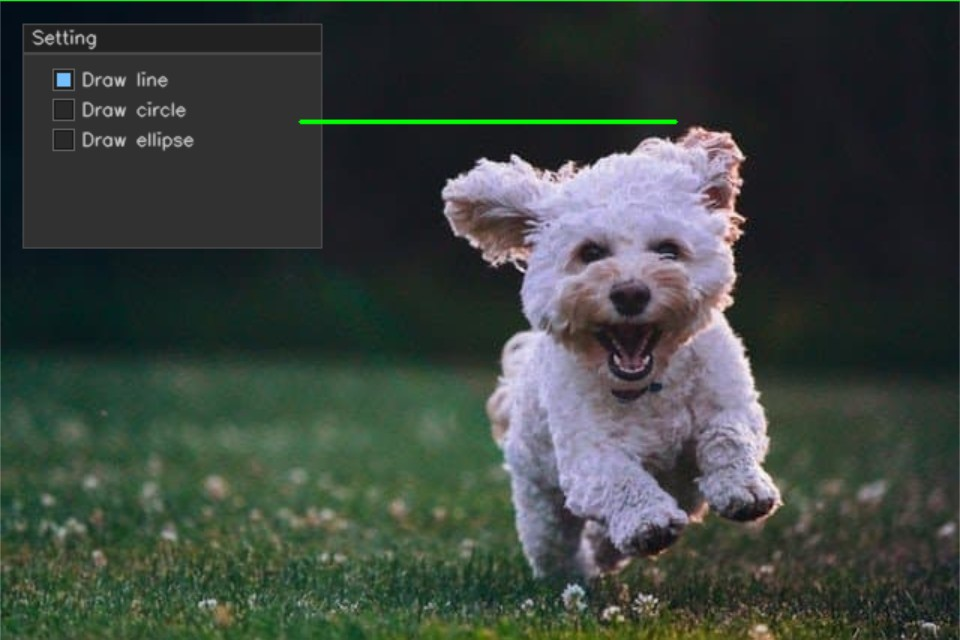
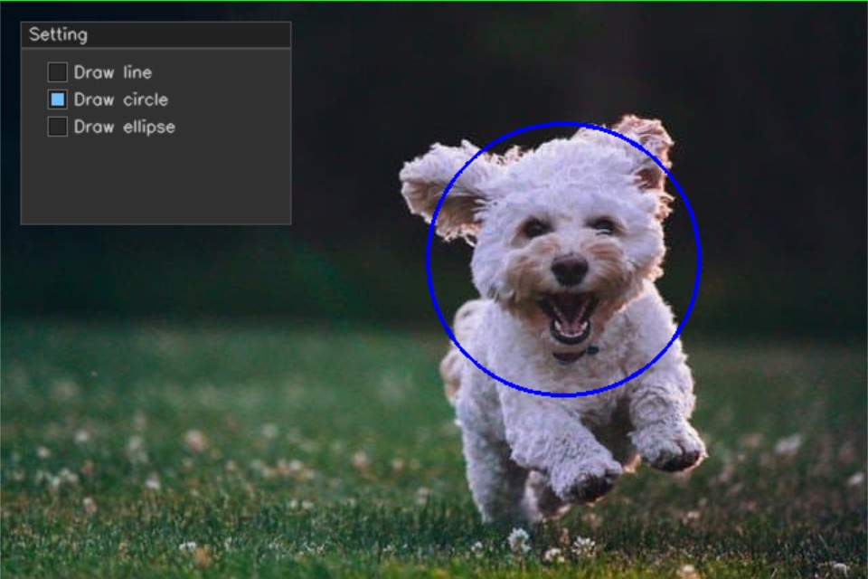
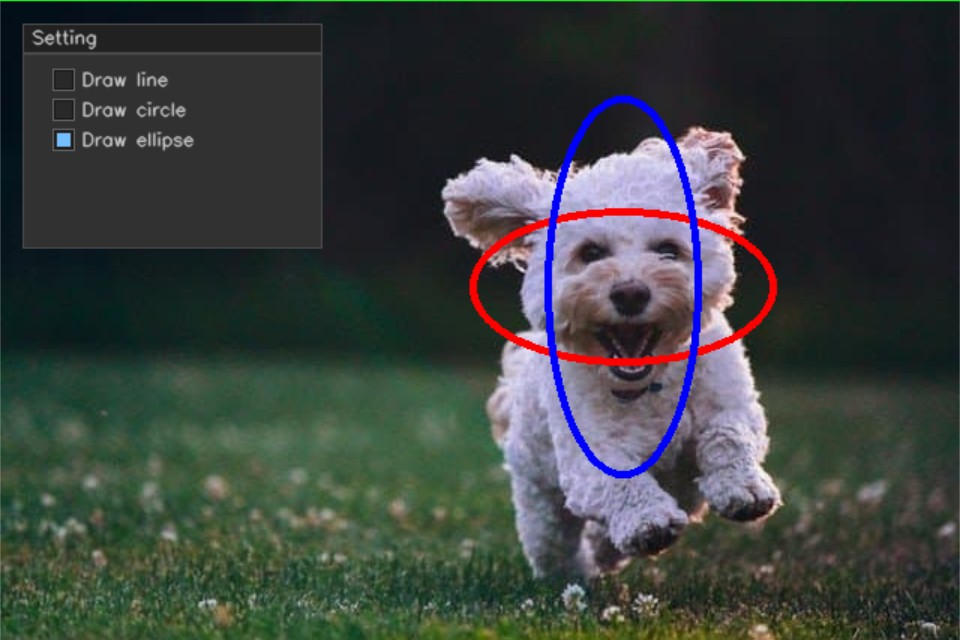
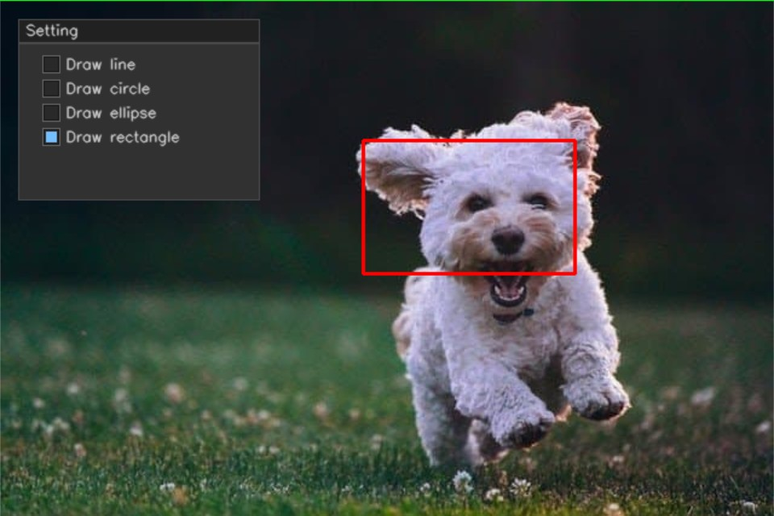
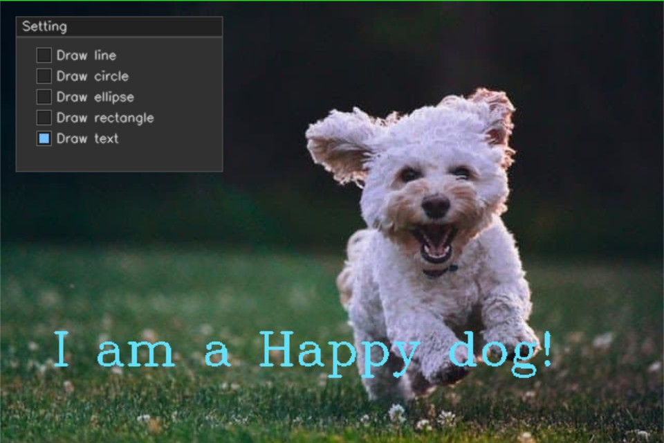

# 注释图像

在OpenCV中注释图像很简单

- 为图像添加信息
- 绘制物体边框
- 图像分割

使用的演示[图像](image/sample.jpg)

## 线段绘制

``` cpp {.line-numbers}
// line
cv::Point start_point(200, 80);
cv::Point end_point(450, 80);

cv::line(draw_line_img, start_point, end_point, cv::Scalar(0, 255, 0), 2, cv::LINE_8);
```



`void cv::line(cv::InputOutputArray img, cv::Point pt1,cv::Point pt2,const cv::Scalar& color, int thickness = 1,int lineType = cv::LINE_8);`

- `img` 输入/输出图像
- `pt1` 线段起始点
- `pt2` 线段终点
- `color` 线段颜色
- `thickness` 线段的宽度,默认为1
- `linetype` 线段类型;默认为`LINE_8`,表示连接线

## 圆形绘制

``` cpp {.line-numebrs}
// circle
cv::Point circle_center(415, 190);
int circle_radius = 100;

cv::circle(draw_annotation_img, circle_center, circle_radius, cv::Scalar(255, 0, 0), 2);
```



绘制圆形的参数基本与线段一致

`cv::circle(image,circle_center,circle_radius,color,thickness)`

- `circle_center` 圆形中心坐标
- `circle_radius` 圆形半径

### 如何绘制实心圆

我们将绘制圆形的参数中的线段粗细改为-1.即可绘制实心圆.

### 如何绘制椭圆

``` cpp {.line-numbers}
// ellipse
cv::Point axis1(100, 50);
cv::Point axis2(125, 50);

cv::ellipse(draw_annotation_img, circle_center, axis1, 0, 0, 360, cv::Scalar(0, 0, 255), 3);
cv::ellipse(draw_annotation_img, circle_center, axis2, 90, 0, 360, cv::Scalar(255, 0, 0), 3);
```



参数与圆也很相似

``` cpp
cv::ellipse(img,center,axis,angle,startangle,endangle,color,thickness);
```

- `axis` 使用`cv::Point`创建椭圆的长轴与短轴
- `angle` 椭圆旋转角度
- `startangle` 椭圆绘制起始角度
- `endangle` 椭圆绘制结束角度

!!! tip
    如果我们将`startangle`设置为0,`endangle`设置为180,我们就会得到半椭圆,同样的,我们将线段宽度设置为-1,会得到实心椭圆.

## 绘制矩形

``` cpp {.line-numbers}
// rectangle
cv::Point rect_start_point(300, 115);
cv::Point rect_end_point(475, 225);

cv::rectangle(draw_annotation_img, rect_start_point, rect_end_point, cv::Scalar(0, 0, 255), 2);
```



绘制矩形的方式与线段极其类似,起始点为矩形的左上角,结束点为矩形的右下角.

## 绘制文本

``` cpp {.line-numbers}
// text
cv::Point text_position(50, 350);

cv::putText(draw_annotation_img, "I am a Happy dog!", text_position, cv::FONT_HERSHEY_COMPLEX, 1.5, cv::Scalar(250, 225, 100));
```



``` cpp
cv::putText(img,text,position,fontFace,fontScale,color,thickness)
```

- `text` 显示文本
- `position` 文本框左下角坐标
- `fontFace` 字体类型
- `fontScale` 字体缩放比例
