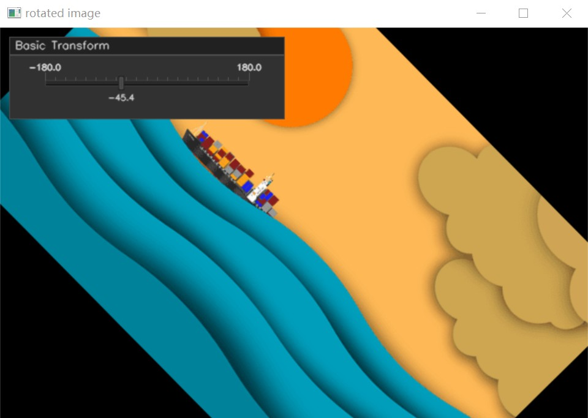
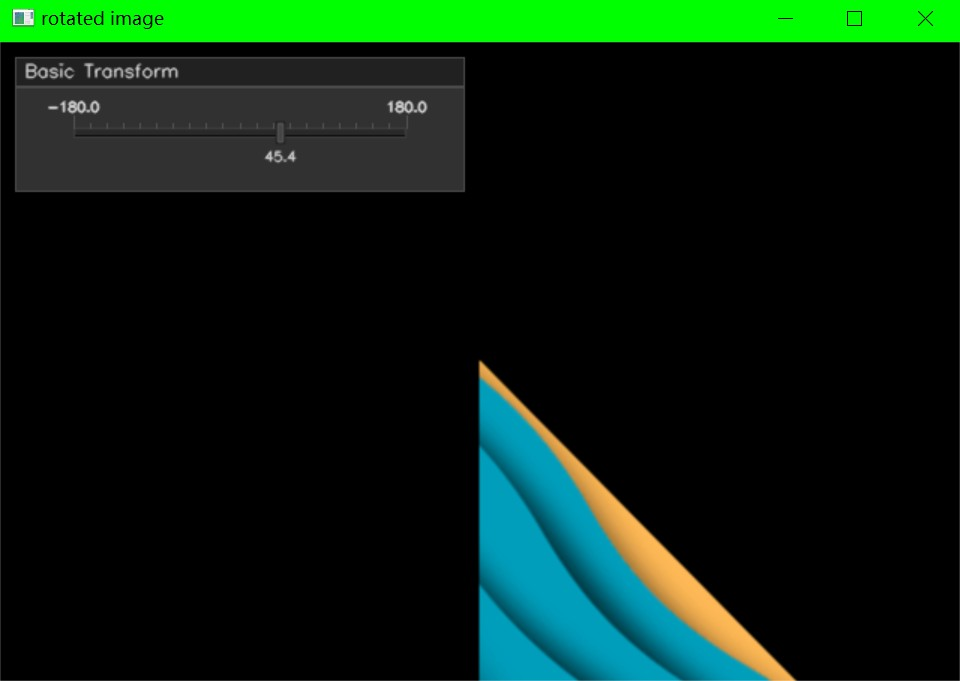

# 图像的基本变换

这里加入了[cvui](https://dovyski.github.io/cvui/)库,可以调整参数对图像变化进行观察.

## 图像的旋转

``` cpp {.line-numbers}
int main()
{
    cv::Mat image = cv::imread("./image/image_rt.jpg");

    if(image.empty())
    {
        LOG("Load image error!");

        return -1;
    }

    cv::imshow("image", image);

    cv::Point2f center((image.cols - 1) / 2.0, (image.rows - 1) / 2.0);

    cv::Mat rotate_image;

    double angle{ 1 };

    cv::namedWindow("rotated image");
    cvui::init("rotated image");
    while (cv::waitKey(30) != 27)
    {

        cv::Mat rotation_matrix = cv::getRotationMatrix2D(center, angle, 1.0);

        cv::warpAffine(image, rotate_image, rotation_matrix, image.size());

        cvui::trackbar(rotate_image, 10, 10, 220, &angle, (double)0.0, (double)180.0, 10.);

        cvui::update();
        cv::imshow("rotated image", rotate_image);
    }

    cv::destroyAllWindows();
    return 0;
}
```



我们将这个过程拆开来看

1. 我们先将图像的原点平移到坐标原点
   [1,0,-center.x]
   [0,1,-center.y]
2. 随后我们对图像进行旋转
   [cos(angle),-sin(angle),0]
   [sin(angle),cos(angle),0]
3. 最后我们需要将图像平移会原来的位置
   [1,0,center.x]
   [0,1,center.y]

我们对图像应用上述矩阵即可达到旋转图像的目的,当然我们也可以直接使用上述三个过程的符合矩阵

[cos(angle), -sin(angle), center.x * (1 - cos(angle)) + center.y * sin(angle)]
[sin(angle), cos(angle), center.y * (1 - cos(angle)) - center.x * sin(angle)]

在OpenCV中我们可以使用`cv::getRotationMatrix2D`函数创建上述旋转矩阵.

`cv::Mat cv::getRotationMatrix2D(Point2f center, double angle, double scale)`

- `center` 图像的旋转中心
- `angle` 图像旋转角度
- `scale` 图像的缩放

为了更好的理解我们不使用`cv::getRotationMatrix2D`函数来旋转图像.

``` cpp {.line-numbers}
#include <iostream>
#include <string>

#include <opencv2/opencv.hpp>

#define CVUI_IMPLEMENTATION
#include "../ref/cvui.h"

#define LOG(x) std::cout<< x << '\n'

int main()
{
    cv::Mat image = cv::imread("./image/image_rt.jpg");
    cv::imshow("image", image);

    cv::Point2f center((image.cols - 1) / 2.0, (image.rows - 1) / 2.0);

    cv::Mat rotate_image;

        double angular{ 45.4 };
        
    cv::namedWindow("rotated image");
    cvui::init("rotated image");
    while (cv::waitKey(7) != 27)
    {
        double angle = angular * CV_PI / 180.0;

        cv::Mat trans_origin_mat = (cv::Mat_<double>(2, 3) << 1, 0, -center.x,
                    0, 1, -center.y);

        cv::Mat rorate_origin_mat = (cv::Mat_<double>(2, 3) << std::cos(angle), -std::sin(angle), 0,std::sin(angle), std::cos(angle), 0);

        cv::Mat trans_mat = (cv::Mat_<double>(2, 3) << 1, 0, center.x,0, 1, center.y);

        cv::Mat rotation_matrix = cv::getRotationMatrix2D(center, angle, 1.0);

        cv::warpAffine(image, rotate_image, trans_origin_mat, image.size());
        cv::warpAffine(rotate_image, rotate_image, rorate_origin_mat, image.size());
        cv::warpAffine(rotate_image, rotate_image, trans_mat, image.size());

        cvui::window(rotate_image, 10, 10, 300, 90, "Basic Transform");
        cvui::trackbar(rotate_image, 35, 35, 250, &angular, (double)-180.0, (double)180.0, 1.);

        cvui::update();
        cv::imshow("rotated image", rotate_image);
    }

    cv::destroyAllWindows();
    return 0;
}
```



从结果可以看出我们依旧成功的旋转了图片.

!!!warning
    图片显示不全的原因是我们对图像进行变换时,超出的部分被裁剪掉了,我们可以通过实时更改图像与窗口的大小来完全显示图像;这里不做演示.

## 图像的平移

完成旋转后,平移就很简单了,我们只需要一个平移矩阵就可以完成任务了.

