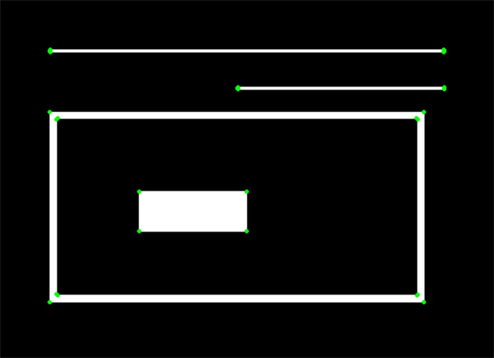
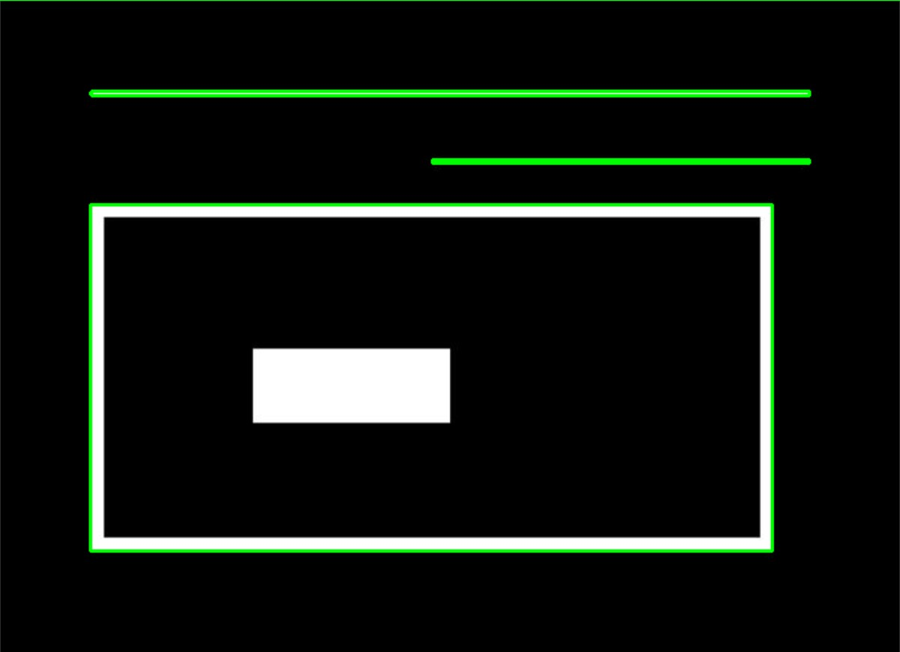

# 图像的轮廓检测

使用轮廓检测,我们可以检测物体的边界,并在图像中定位他们.

## 什么是等值线

当我们连接对象边界所有的点时,我们等到一个轮廓;通常轮廓是指具有相同颜色的强度的边界像素.

OpenCV为我们提供了两个函数

- findContours()
- drawContours()

此外还有两种不同的轮廓检测算法

- CHAIN_APPROX_SIMPLE
- CHAIN_APPROX_NONE

## 在OpenCV中检测和绘制轮廓的步骤

1. 读取图像并将其转化为灰度图
2. 应用二进制阈值
3. 查找轮廓
4. 在原始图像绘制轮廓

## 使用CHAIN_APPROX_NONE检测轮廓

``` cpp {.line-numbers}
int main()
{
    cv::Mat image = cv::imread("./image/image_1.jpg");

    if (image.empty())
    {
        LOG("load image error!");

        cv::destroyAllWindows();
        return -1;
    }

    cv::Mat image_gray;
    cv::cvtColor(image, image_gray, cv::COLOR_BGR2GRAY);

    cv::Mat image_thresh;
    cv::threshold(image_gray, image_thresh, 150, 255, cv::THRESH_BINARY);

    cv::imshow("thresh binary", image_thresh);

    // CHAIN_APPROX_NONE
    std::vector<std::vector<cv::Point>> contours;
    std::vector<cv::Vec4i> hierarchy;
    cv::findContours(image_thresh, contours, hierarchy, cv::RETR_TREE, cv::CHAIN_APPROX_NONE);
    // Draw contours
    cv::Mat origin_image_copy = image.clone();
    cv::drawContours(origin_image_copy, contours, -1, cv::Scalar(0, 255, 0), 2);
    cv::imshow("image contours", origin_image_copy);

    cv::waitKey(0);
    cv::destroyAllWindows();

    return 0;
}
```

`findContours(src/dst, contours, hierarchy, mode, method, offset);`函数有三个必要的参数.

- `src/dst` 经过阈值处理过的图像
- `contours` 输出参数,储存检测到的轮廓;他是`std::vector<std::vector<cv::Point>>`类型.
- `hierarchy` 输出参数,可选的轮廓层次结构,他是一个`std::vector<cv::Vec4i>`类型,用于存储轮廓的父子关系.
- `model` 轮廓检索模式,指定轮廓的层次信息.
  - `cv::RETR_EXTERNAL` 仅检索最外层轮廓.
  - `cv::RETR_LIST` 检索所有轮廓,但不建立层次关系.
  - `cv::RETR_TREE` 检索所有轮廓,并建立完整的轮廓层次机构.
- `method` 轮廓近似方法,指定如何存储轮廓的点
  - `cv::CHAIN_APPROX_NONE` 存储所有轮廓点
  - `cv::CHAIN_APPROX_SIMPLE` 仅存储轮廓的端点

`drawContours(src/dst, controus, contourIdx, color,thickness, lineType, heirarchy,maxLevel,offset);`

- `contours` 输入的轮廓数组
- `contoursIdx` 指定要绘制的轮廓的索引;为负数时,绘制所有轮廓.
- `heirarchy` 可选的轮廓层次结构.
- `maxLevel` 可选的最大层级深度,用于限制绘制的层级数目.


该算法生成的轮廓再识别每个对象的边界方面做的很好,但是不足的是它包含多个轮廓(摄像头部分),这些是我们不需要的.

!!! warning
    值得注意的是,轮廓算法的准确性和质量在很大程度上取决于提供的阈值处理图像.

单独的蓝绿红通道**无法**正确的识别轮廓信息.

## 使用CHAIN_APPROX_SIMPLE绘制轮廓

``` cpp
cv::findContours(image_thresh, contours, hierarchy, cv::RETR_TREE, cv::CHAIN_APPROX_SIMPLE);
```


可以看出该算法与上面的几乎没有区别,这要归功于`drawContours`函数;该函数会连接相邻的点.

`SIMPLE`算法沿轮廓压缩水平,竖直线段和对角线段,只保留其端点;以一个矩形为例,只有四个角被保留,其余等值线的点都被忽略.

我们将手动遍历轮廓点,并在其上绘制一个圆.

``` cpp {.line-numbers}
cv::Mat simple_image = image.clone();

for (int i = 0; i < contours.size(); i++)
    for (int j = 0; j < contours[i].size(); j++)
        cv::circle(simple_image, (contours[i], contours[i][j]), 2, cv::Scalar(0, 255, 0), 2);

 cv::imshow("simple image", simple_image);
```



上图可以完全证明`CHAIN_APPROX_SIMPLE`值计算出轮廓边界端点.

### 轮廓层级关系

#### 亲子关系

通过轮廓算法在图像中检测到的对象可能是:

- 分散在图像中的单个轮廓.
- 轮廓和轮廓的内部轮廓.

大多数情况下,我们可以安全的得出外部轮廓是内部轮廓的父轮廓.


我们将使用上图来得出结论


- 根据等值线层次结构和父子关系,所有单独的数字都是单独的轮廓(1,2,3,4)
- 我们将3a称为3的子轮廓,3a标识3的内部部分
- 1,2,4都是父轮廓,无任何关联的子轮廓,因此他们的编号是随机的.

#### 等值线关系表示

等高线层次结构为一个数组,而数组是又包含四个值的数组.

[Next, Previous, First_Child, Parent]

- `Next` 表示图像中的下一个轮廓,该轮廓与此轮廓处于同一级别.
  - 对于等值线1,Next为2
  - 对于等值线2,Next为3
  - 对于等值线4,Next为-1;后无与他处在同一级别的等值线
- `Previous` 表示同一层次结构的上一个轮廓
- `First_Child` 表示当前轮廓的第一个子轮廓
  - 轮廓1,2无子项索引为-1
  - 轮廓三有子轮廓,索引为3a所在位置的索引
- `Parent` 父级
  - 对于1,2来说,无父级索引为-1
  - 对于3a,4来说索引为3,与3a

### 不同的轮廓检索技术

#### RETR_LIST

该技术不会提取轮廓之间任何的父子关系,因此对于所有的等值线区域,`First_Child`和`Parent`索引始终为-1.

#### RETR_EXTERNAL

它仅检测父轮廓,忽略一切子轮廓.



#### RETR_CCOMP

与检索图像中所有的轮廓不同,除此之外,他还将2级层次结构应用于图像中所有的轮廓

- 所有外部轮廓的层次结构级别为1
- 所有内部轮廓的层次结构级别为2

如果轮廓级别为2的轮廓内部拥有一个轮廓

- 这个内轮廓的级别为1
- 如果这个内轮廓内部还具有一个轮廓,其级别为2


#### RETR_TREE

就像检索所有轮廓结构一样,他还创建一个完整的层次结构,级别不限于1,2.


### 不同轮廓检索方法的运行时比较

数据来自[learnopencv](https://learnopencv.com/contour-detection-using-opencv-python-c/)

|轮廓检索方法|花费时间(s)|
|---|---|
|RETR_LIST|0.000382|
|RETR_EXTERNAL|0.000554|
|RETR_CCOMP|0.001845|
|RETR_TREE|0.005594|

## 局限性

当图像与背景对比不强烈时


