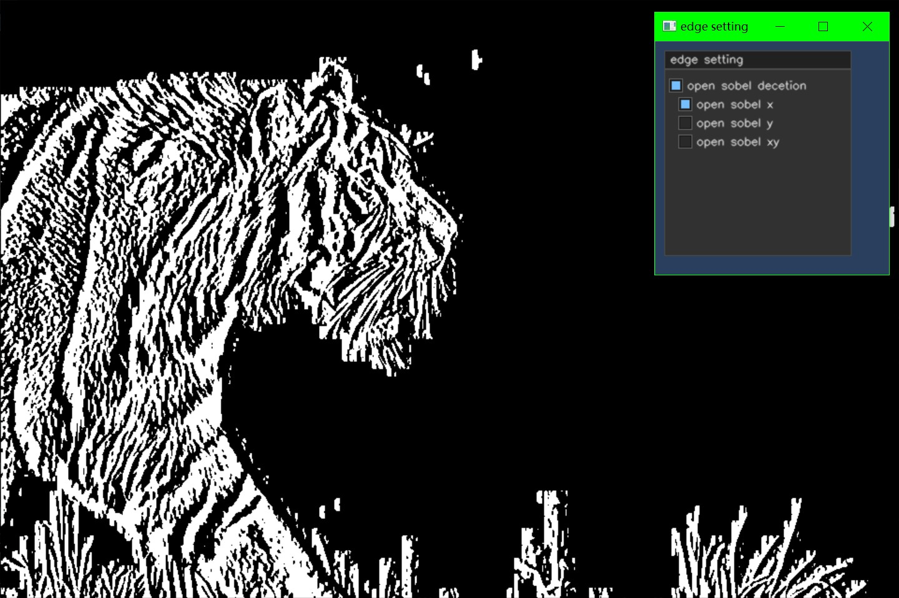
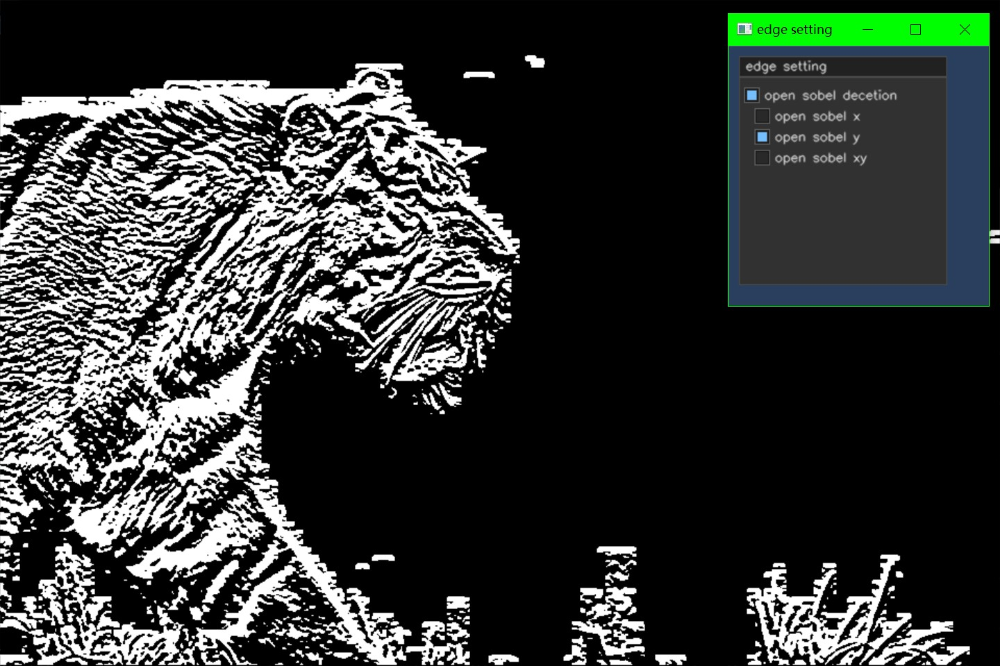
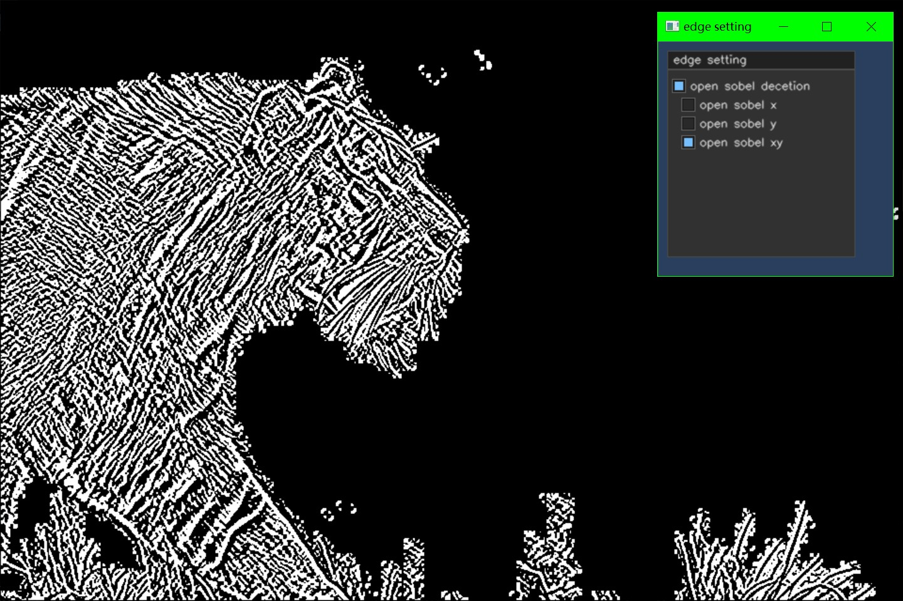
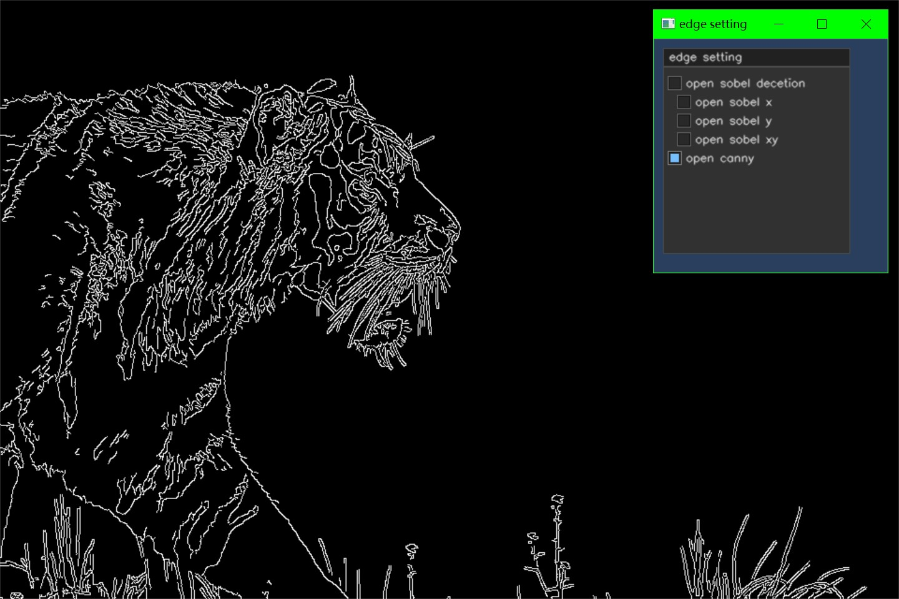

# 边缘检测

边缘检测是一种图像处理技术,用于识别图像中对象或区域的边界.

像素值的突然变化是边缘的特征,我们需要在相邻的像素中寻找这种变化来检测边缘.

## 使用Sobel边缘检测

``` cpp {.line-numbers}
int main()
{
    cv::Mat image = cv::imread("./image/input_image-1.jpg",0);

    if (image.empty())
    {
        LOG("load image error!");

        cv::destroyAllWindows();
        return -1;
    }

    cv::imshow("origin", image);

    cv::namedWindow("edge setting");
    cvui::init("edge setting");

    cv::Mat edge_image;
    cv::Mat ui_window(250,250,CV_8UC3);

    bool open_sobel{ false };
    bool open_x{ false };
    bool open_y{ false };
    bool open_xy{ false };

    while (cv::waitKey(15) != 'q')
    {
        edge_image = image.clone();
        ui_window = cv::Scalar(93, 62, 42);
        cv::Mat blur_image;

        cv::GaussianBlur(image, blur_image, cv::Size(3, 3), 0, 0);

        if (open_sobel)
        {
            if (open_x)
                cv::Sobel(blur_image, edge_image, CV_64F, 1, 0, 5);
            else if (open_y)
                cv::Sobel(blur_image, edge_image, CV_64F, 0, 1, 5);
            else if (open_xy)
                cv::Sobel(blur_image, edge_image, CV_64F, 1, 1, 5);
            else
                edge_image = blur_image.clone();
        }
        cv::imshow("edge detection", edge_image);

        cvui::window(ui_window, 10, 10, 200, 220, "edge setting");
        cvui::checkbox(ui_window, 15, 40, "open sobel decetion", &open_sobel);
        cvui::checkbox(ui_window, 25, 60, "open sobel x", &open_x);
        cvui::checkbox(ui_window, 25, 80, "open sobel y", &open_y);
        cvui::checkbox(ui_window, 25, 100, "open sobel xy", &open_xy);
        cvui::update();

        cv::imshow("edge setting", ui_window);
    }

    cv::destroyAllWindows();
    return 0;
}
```







``` cpp
void cv::Sobel(src,dst,int ddepth,int dx,int dy,int ksize);
```

- `ddepth` 输出图像的深度,通常使用`CV_64F`来保留边缘强度的浮点数
- `dx` 求导的x方向(1, 0, -1)
- `dy` 求导的y方向(1, 0, -1)
- `ksize` 卷积核尺寸

## Canny边缘检测

Canny边缘检测分为四个阶段

1. 降噪
2. 计算图像的强度梯度
3. 抑制假边
4. 滞后阈值

### 降噪

原始图像通常会有噪点;我们使用高斯模糊来尽可能地保存图像原有的细节.


### 计算图像的强度梯度

图像被平滑后,使用Sobel内核进行水平与垂直过滤,这些过滤操作的结果将用于计算每个像素的强度梯度幅度(G),和方向($\theta$)

$$G=\sqrt{G^2_{x} + G^2_{y}} $$

$$\theta = \tan^{-1}(\frac{G_{x}}{G_{y}})$$

然后将渐变方向舍入到最接近45度角.


### 抑制假边

该步骤使用的算法使用边缘非最大抑制的技术来过滤不需要的像素;每个像素与其正负梯度上的相邻像素进行比较,如果当前像素的梯度幅度大于其相邻的像素,则保持不变,否则被设置为0.


### 滞后阈值

在Canny边缘检测的最后一步中,将梯度幅度与两个阈值进行比较,一个阈值小于另一个阈值.

- 如果梯度幅度值高于较大阈值,则这些像素与实体边缘有关,并保留.
- 如果小于较小阈值,将其舍弃.
- 如果值在两个阈值之间,则作为保留边缘,被标记为"弱"(最终图像边缘的候选者)
- 如果"弱"像素与实体边缘关联,则被保留.

``` cpp
cv::Canny(blur_image, edge_image, 100, 200, 3, false);
```



``` cpp
cv::Canny(src,dst,thresh01,thresh02,ksize,false);
```

- `thresh01` 较小阈值
- `thresh02` 较大阈值
- `ksize` 用于Sobel过滤的内核大小
