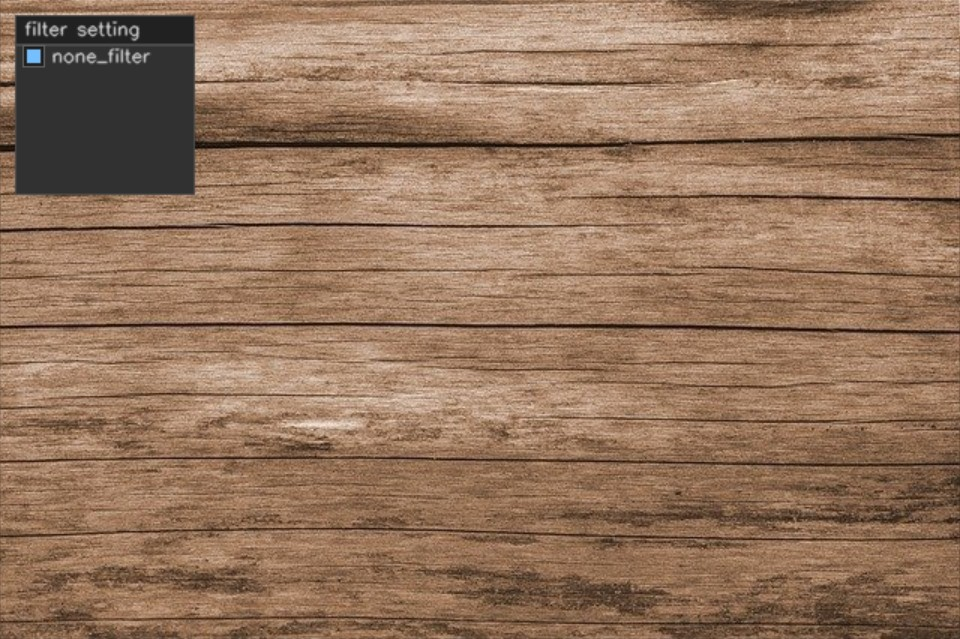
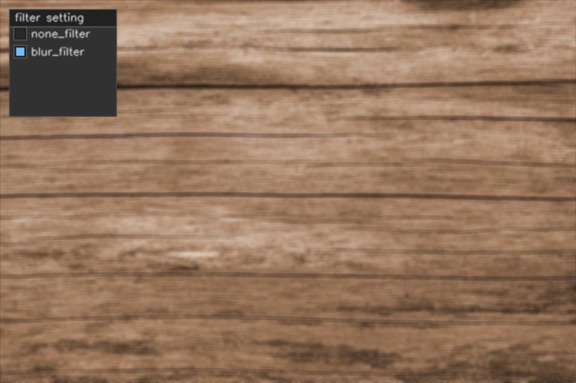
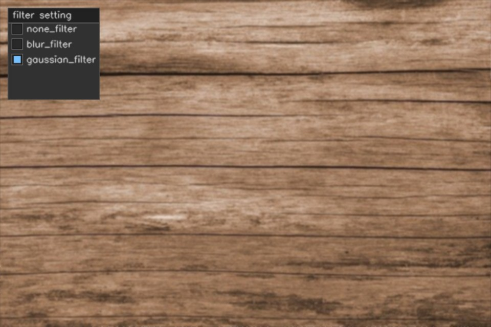
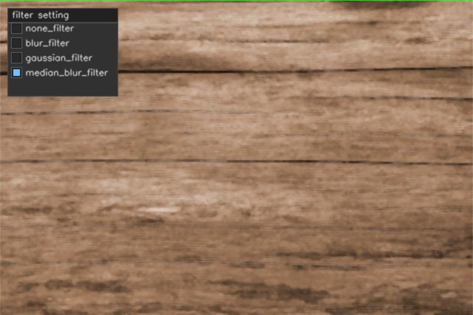
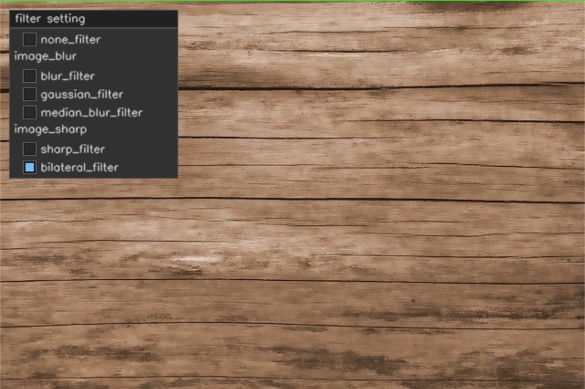
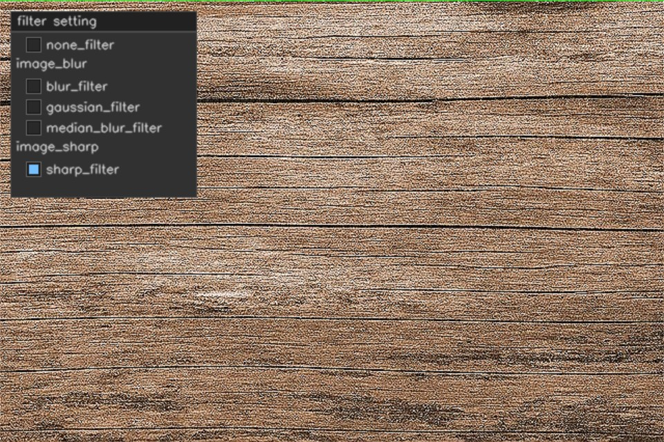

# 使用卷积过滤图像

## 图像处理中的卷积内核

在图像处理中,卷积核是用来过滤图像的2D矩阵;卷积核也称为卷积矩阵,它通常是奇整数矩阵(3*3,5*5,7*7).

$$\begin{vmatrix}
  1&  1& 1\\
  1&  1& 1\\
  1&  1& 1
\end{vmatrix}$$

上面是一个3*3的二维卷积核,卷积核可以对图像的每个像素进行数学运算,以达到锐化或模糊的效果.

- 减少早点的模糊通常称为平滑.
- 将我们不关注的物体进行模糊

## 使用卷积核对图像进行模糊

- 假设内核的中心位置位于图像中的特定像素(p)上
- 然后将内核中每个元素的值与原图像中相应的像素值相乘
- 现在,将这些乘法的结果相加并计算平均值
- 最后,将像素值(p)的值替换为刚刚计算的值

### 什么是标识内核

标识内核是一种特殊的卷积核,他不对图像进行任何操作.

$$\begin{vmatrix}
  0&  0& 0\\
  0&  1& 0\\
  0&  0& 0
\end{vmatrix}$$

接下来我们用程序来证明它确实什么都没有做

``` cpp {.line-numbers}
int main()
{
    cv::Mat image = cv::imread("./image/input-image-of-wood.jpg");

    if (image.empty())
    {
        LOG("Load image error!");

        return -1;
    }

    cv::imshow("origin image", image);

    cv::Mat kernel_none = (cv::Mat_<double>(3, 3) << 0, 0, 0, 0, 1, 0, 0, 0, 0);
    cv::Mat filter_image;

    bool none_filer{ true };

    cv::namedWindow("Filter image");
    cvui::init("Filter image");

    while (cv::waitKey(30) != 'q')
    {
        filter_image = image.clone();
        cvui::window(filter_image, 10, 10, 120, 120,"filter setting");
        cvui::checkbox(filter_image, 15, 30, "none_filter", &none_filer);

        if (none_filer)
            cv::filter2D(filter_image, filter_image, -1, kernel_none, cv::Point(-1, -1),0,cv::BORDER_DEFAULT);

        cv::imshow("Filter image", filter_image);

        cvui::update();
    }

    cv::destroyAllWindows();
    return 0;
}
```



``` cpp
cv::filter2D(src, dst, ddepth, kernel, anchor,delta,cv::BORDER_DEFAULT);
```

- `ddepth` 图像的深度;通道数,-1为与输出相同
- `kernel` 使用的卷积核
- `anchor` 卷积核的中心,默认为-1,-1,标识卷积核的中心为中心
- `delta` 可选的偏移值,用于调整输出图像的亮度.
- `borderType` 边界处理方式,默认为`cv::BORDER_DEFAILT`

### 使用自定义卷积核模糊图像

需要注意的是,当我们定义一个M\*N的内核时,我们需要将内核除以M\*N,这是我们为了确保值的归一化.

下面案例中我们将创建一个5*5的卷积核,来对图像进行模糊处理.

``` cpp {.line-numbers}
cv::Mat kernel_02 = cv::Mat::ones(5, 5, CV_64F);
cv::Mat kernel_blur = kernel_02 / 25;
bool blur_filter{ false };

cv::filter2D(filter_image, filter_image, -1, kernel_blur, cv::Point(-1, -1), 0, cv::BORDER_DEFAULT);
```



当然OpenCV中内置了`blur`函数,也可以完成相同的效果.

``` cpp 
cv::blur(filter_image, filter_image, cv::Size(5, 5));
```

### 对图像进行高斯模糊

高斯模糊使用的高斯核,中心像素具有最高权重,周围像素的权重逐渐减小.

``` cpp
cv::GaussianBlur(filter_image, filter_image, cv::Size(5, 5), 0, 0);
```



``` cpp
cv::GaussianBlur(src, dst, ksize, sigmaX, sigmaY);
```

- `ksize` 高斯核的大小
- `sigmaX/Y` 标准差,它决定了模糊的程度和范围;默认为0.

### 对图像进行中值模糊

在中值模糊中,原图像的每个像素都被替换为内核区域中图像像素的中值.

1. 定义一个固定大小的邻域(通常是一个正方形或矩形区域),例如3\*3、5\*5等
2. 对图像中的每个像素,将其邻域内的像素值进行排序
3. 选择排序后的中间值作为当前像素的输出值

``` cpp
cv::medianBlur(filter_image, filter_image, (5, 5));
```



### 对图像应用双边滤波

当我们对图像进行模糊处理来减少噪点时,我们通常不希望模糊整个图像,因为重要的细节核锋利的边缘我们希望是要保留的.

值得庆幸的是,OpenCV提供了`bilateralFilter()`函数来过滤图像.

``` cpp
cv::bilateralFilter(image, filter_image, 9, 75, 75);
```



``` cpp
cv::bilateralFilter(src,dst,d,sigmaColor,sigmaSpace);
```

- `d` 滤波窗口的直径;通常为正整数,滤波窗口的尺寸为(2\*d+1)\*(2\*d+1).
- `sigmaColor` 像素值相似性高斯函数的标准差,用于控制像素值相似性的权重
- `sigmaSpace` 空间距离高斯函数的标准差,用于控制空间距离的权重

## 锐化图像

### 使用自定义卷积核锐化图像

``` cpp {.line-numbers}
cv::Mat kernel_sharp = (cv::Mat_<double>(3, 3) << 0, -1, 0, -1, 5, -1, 0, -1, 0);

cv::filter2D(filter_image, filter_image, -1, kernel_sharp, cv::Point(-1, -1), 0, cv::BORDER_DEFAULT);
```


