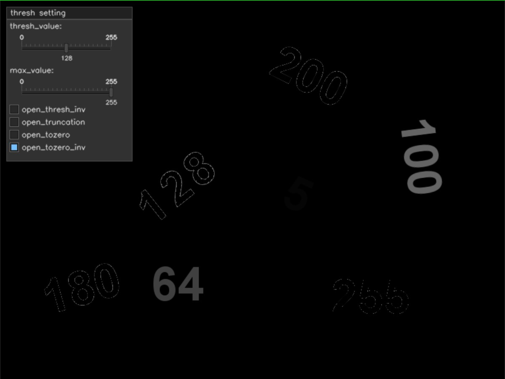

# 图像阈值

## 全局阈值

当阈值的规则应用于图像中的每个像素,并且阈值是固定的时,这个操作被称为全局阈值.

全局阈值算法将源图像(src)的**各个像素**和**阈值**(thresh)作为输入,通过比较**像素值的强度**与阈值来输出图像(dst),如果*src > thresh*,则dst(x, y)被分配一些值.否则,dst(x, y)被分配一些其他值.

### 二进制阈值

**二进制阈**值是最简单的全局阈值.

- 除了源图像和阈值之外,还需要另一个称为最大值(maxValue)的输入参数.

如果src(x, y)大于thresh,阈值操作会将图像像素的值设置为maxValue,否则将其设置为0.

``` cpp {.line-numbers}
int main()
{
    cv::Mat image = cv::imread("./image/threshold.jpg");

    if (image.empty())
    {
        LOG("load image error!");

        return -1;
    }

    cv::imshow("src image", image);

    cv::namedWindow("image thresh");
    cvui::init("image thresh");

    cv::Mat thresh_image;

    double thresh_value{ 0 };
    double max_value{ 255 };

    while (cv::waitKey(30) != 'q')
    {
        thresh_image = image.clone();

        cv::threshold(image, thresh_image, thresh_value, max_value, cv::THRESH_BINARY);

        cvui::window(thresh_image, 10, 10, 150, 200, "thresh setting");
        cvui::text(thresh_image, 15, 35, "thresh_value:");
        cvui::trackbar(thresh_image, 20, 50, 120, &thresh_value, (double)0.0, (double)255.0);
        cvui::text(thresh_image, 15, 105, "max_value:");
        cvui::trackbar(thresh_image, 20, 120, 120, &max_value, (double)0.0, (double)255.0);

        cv::imshow("image thresh", thresh_image);

        cvui::update();
    }

    cv::destroyAllWindows();
    return 0;
}
```

我们可以看到当阈值为0时,大于0的值都被设置为255,原图中很难看清的5也变得非常清楚了.


当阈值为138时,所有小于等于138的值都将被修改为0,其余都被修改为255.


阈值不变时将`max_value`修改为201,则所有大于阈值的值都将修改为201.


``` cpp {.line-numbers}
cv::threshold(src,dst,thresh,maxval,type);
```

- `(double)thresh` 阈值
- `(double)maxval` 最大值
- `type` 阈值化类型

### 逆二进制阈值

反向二进制阈值与二进制阈值相反,只要将`type`参数改为`cv::THRESH_BINARY_INV`即可.


### 截断阈值(cv::THRESH_TRUNC)

- 如果源像素值大于阈值,则目标像素值设置为阈值.
- 小于不做改变
- 最大值被忽略


上图所示,小于101的值不做改变,大于101的值都改变为101;最大值被忽略.

### 阈值为零(cv::TRESH_TOZERO)

- 如果像素值大于等于零,则目标像素值不变
- 否则,将其设置为零
- 最大值被忽略


### 倒置阈值为零(cv::THRESH_TOZERO_INV)

- 如果像素值大于阈值,则设置为零
- 否则不变
- 最大值被忽略


