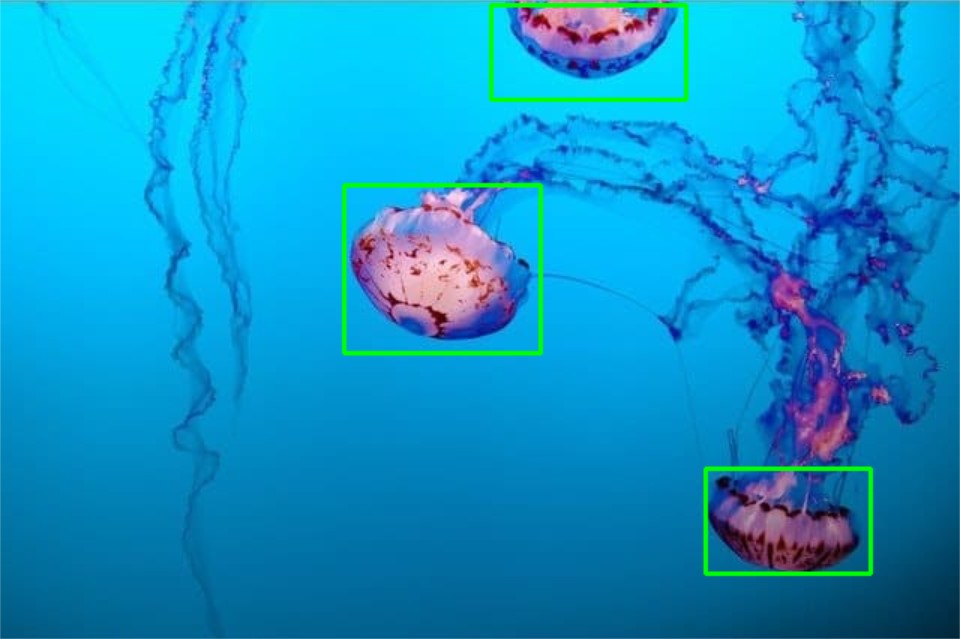
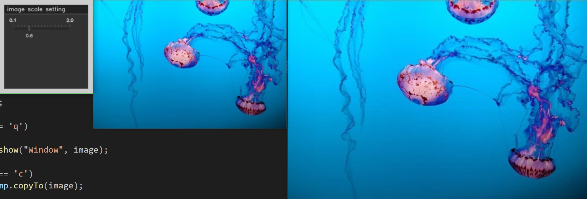
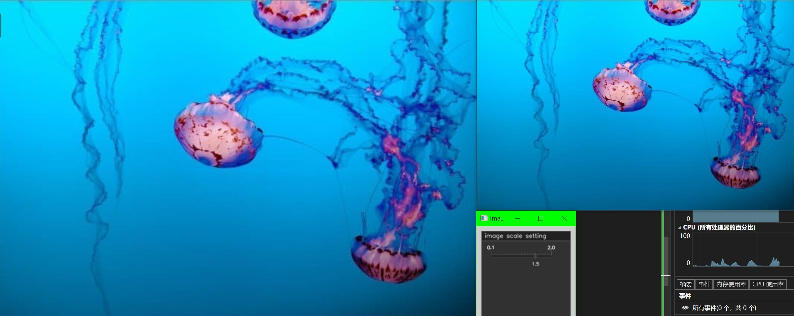

# GUI中的鼠标和滑动条

## 鼠标绘制矩形

``` cpp {.line-numbers}
cv::Point top_left_corner, bottom_right_corner;
cv::Mat image;

void draw_rectangle(int action, int x, int y, int flags, void* userdata);

int main()
{
    image = cv::imread("./image/input_image-2.jpg");

    if (image.empty())
    {
        LOG("load image error!");

        cv::destroyAllWindows();
        return -1;
    }

    cv::Mat temp = image.clone();
    cv::namedWindow("Window");
    cv::setMouseCallback("Window", draw_rectangle);

    int k{ 0 };

    while (k != 'q')
    {
        cv::imshow("Window", image);

        if (k == 'c')
        temp.copyTo(image);

        k = cv::waitKey(0);
    }

    cv::destroyAllWindows();
    return 0;
}

void draw_rectangle(int action, int x, int y, int flags, void* userdata)
{
    if (action == cv::EVENT_LBUTTONDOWN)
        top_left_corner = cv::Point(x, y);
    else if (action == cv::EVENT_LBUTTONUP)
    {
        bottom_right_corner = cv::Point(x, y);
        cv::rectangle(image, top_left_corner, bottom_right_corner, cv::Scalar(0, 255, 0), 2, cv::LINE_8);
        cv::imshow("Window", image);
    }
}
```

我们使用`cv::setMouseCallback`来注册鼠标事件的回调.



## 使用滑动条来调整图像的缩放

!!! tip
    这里我们直接使用`cvui`库,进行GUI操作.

``` cpp {.line-numbers}
cv::Point top_left_corner, bottom_right_corner;
cv::Mat image;

double scale_value{ 1.0 };
double scale_min = 0.1;
double scale_max = 2.0;

void draw_rectangle(int action, int x, int y, int flags, void* userdata);

int main()
{
    image = cv::imread("./image/input_image-2.jpg");

    if (image.empty())
    {
        LOG("load image error!");

        cv::destroyAllWindows();
        return -1;
    }

    cv::Mat temp = image.clone();
    cv::Mat resize_image;
    cv::Mat ui_frame(200, 200, CV_8UC3);
    cv::namedWindow("Window");
    cv::namedWindow("image setting");
    cv::setMouseCallback("Window", draw_rectangle);

    cvui::init("image setting");

    int k{ 0 };

    while (k != 'q')
    {
        cv::imshow("Window", image);

        if (k == 'c')
        temp.copyTo(image);

        cv::resize(temp, resize_image, cv::Size(), scale_value, scale_value, cv::INTER_LINEAR);

        cv::imshow("resise image", resize_image);

        cvui::window(ui_frame, 10, 10, 180, 180, "image scale setting");
        cvui::trackbar(ui_frame, 15, 35, 150, &scale_value, scale_min, scale_max, 1, "%.1Lf");

        cv::imshow("image setting", ui_frame);
        cvui::update();

        k = cv::waitKey(30);
    }

    cv::destroyAllWindows();
    return 0;
}

void draw_rectangle(int action, int x, int y, int flags, void* userdata)
{
    if (action == cv::EVENT_LBUTTONDOWN)
        top_left_corner = cv::Point(x, y);
    else if (action == cv::EVENT_LBUTTONUP)
    {
        bottom_right_corner = cv::Point(x, y);
        cv::rectangle(image, top_left_corner, bottom_right_corner, cv::Scalar(0, 255, 0), 2, cv::LINE_8);
        cv::imshow("Window", image);
    }
}
```




