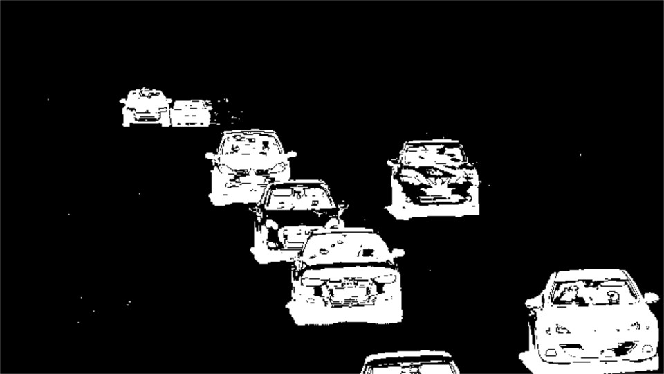

# 视频中的简单背景估计

## 时间中值滤波

为了理解问题,我们先从简单的一维问题入手.

假设我们每10ms记录一个数量(例如房间的温度)

比方说,房间的温度是华氏70℉


上图中我们有两个温度计;好(左侧),坏(右侧).

左侧现实的良好温度为70,并带有一定程度的高斯噪声.为了更准确的估计温度,我们可以简单地在几秒钟内平均这些值.由于噪声具有正负值,他们互相抵消;最后平均温度为70.01.

另一方面,坏的温度计在大多数情况下表现的与好温度计相同,但偶尔他错的过于离谱.

当数据包含异常值时,**中位数**是我们可以使用的最稳健的值.

唯一的缺点是,他要对每个像素进行排序,性能不及平局值.

## 使用中位数进行背景估计

现在让我们回到相机静态时对背景进行估计的问题上.

当相机是静态时,物体会偶尔遮挡背景.

对于视频序列,我们没必要对所有帧进行中位数计算,我们可以从视频序列中采样复数帧进行中位数计算.

``` cpp {.line-numbers}{background-color:#f8f8f8}
int computeMedian(std::vector<int> elements)
{
    std::nth_element(elements.begin(), elements.begin() + elements.size() / 2, elements.end());

    // std::sort(elements.begin(),elements.end());
    return elements[elements.size() / 2];
}

cv::Mat compute_median(std::vector<cv::Mat> vec)
{
    cv::Mat medianImg(vec[0].rows, vec[0].cols, CV_8UC3, cv::Scalar(0, 0, 0));

    for (int row = 0; row < vec[0].rows; row++)
    {
        for (int col = 0; col < vec[0].cols; col++)
        {
            std::vector<int> elements_B;
            std::vector<int> elements_G;
            std::vector<int> elements_R;

            for (int imgNumber = 0; imgNumber < vec.size(); imgNumber++)
        {
            int B = vec[imgNumber].at<cv::Vec3b>(row, col)[0];
            int G = vec[imgNumber].at<cv::Vec3b>(row, col)[1];
            int R = vec[imgNumber].at<cv::Vec3b>(row, col)[2];

            elements_B.push_back(B);
            elements_G.push_back(G);
            elements_R.push_back(R);
        }

        medianImg.at<cv::Vec3b>(row, col)[0] = computeMedian(elements_B);
        medianImg.at<cv::Vec3b>(row, col)[1] = computeMedian(elements_G);
        medianImg.at<cv::Vec3b>(row, col)[2] = computeMedian(elements_R);
        }
    }
    return medianImg;
}

int main()
{
    cv::VideoCapture cap("./video/video.mp4");

    if (!cap.isOpened())
    {
        LOG("open video error!");

        return -1;
    }

    // 随机取25帧取中值.
    std::default_random_engine generator;
    std::uniform_int_distribution<int> distribution(0, cap.get(cv::CAP_PROP_FRAME_COUNT));

    std::vector<cv::Mat> frames;

    for (int i = 0; i < 25; i++)
    {
        int fid = distribution(generator);
        cap.set(cv::CAP_PROP_POS_FRAMES, fid);
        cv::Mat frame;
        cap >> frame;
        if (frame.empty())
        continue;
        frames.push_back(frame);
    }

    cv::Mat median_frame = compute_median(frames);

    cv::imshow("frame", median_frame);

    cap.release();
    cv::waitKey();
    cv::destroyAllWindows();

    return 0;
}
```

!!!tip
    当我们不关心全部元素的排序,只关心哪个位置的元素排序值时我们使用`std::nth_element`函数的性能要高于`std::sort`函数


## 帧拆分

显而易见的是,我们可以为视频序列的每一帧创建一个遮罩,以显示图像中运动的部分.

1. 将中值帧转化为灰度图
2. 循环播放视频序列的所有帧,提取当前帧并将其转化为灰度图
3. 计算当前帧和中值帧之间的绝对差值
4. 对上图进行阈值处理以消除噪声并输出二值化图像

``` cpp {.line-numbers}
cap.set(cv::CAP_PROP_POS_FRAMES, 0);

cv::Mat gray_median_frame;
cv::cvtColor(median_frame, gray_median_frame, cv::COLOR_BGR2GRAY);

cv::Mat frame;

while (cv::waitKey(20) != 'q')
{
    cap >> frame;

    if (frame.empty())
    break;

    cv::cvtColor(frame, frame, cv::COLOR_BGR2GRAY);

    cv::Mat dframe;
    cv::absdiff(frame, gray_median_frame, dframe);

    cv::threshold(dframe, dframe, 30, 255, cv::THRESH_BINARY);

    cv::imshow("video", dframe);
}
```


